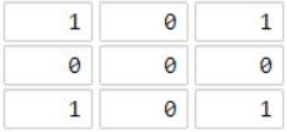
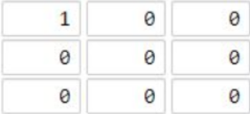

### 题目描述

你现在手里有一份大小为 N x N 的 网格 grid，上面的每个 单元格 都用 0 和 1 标记好了。其中 0 代表海洋，1 代表陆地，请你找出一个海洋单元格，这个海洋单元格到离它最近的陆地单元格的距离是最大的。

我们这里说的距离是「曼哈顿距离」（ Manhattan Distance）：(x0, y0) 和 (x1, y1) 这两个单元格之间的距离是 |x0 - x1| + |y0 - y1| 。

如果网格上只有陆地或者海洋，请返回 -1。

<!-- more -->

示例 1：



输入：[[1,0,1],[0,0,0],[1,0,1]]
输出：2
解释： 
海洋单元格 (1, 1) 和所有陆地单元格之间的距离都达到最大，最大距离为 2。

示例 2：



输入：[[1,0,0],[0,0,0],[0,0,0]]
输出：4
解释： 
海洋单元格 (2, 2) 和所有陆地单元格之间的距离都达到最大，最大距离为 4。

### 思路

这是一个多起点的广度优先搜索

可以将题意理解为，从所有陆地同时出发，每次向四个方向搜索一圈，如果是海域的话就将这个点的值标记为从陆地到这的距离

由此不断进行广搜，直到所有的点变为非0（即表示，地图全部搜索过了）

最后搜索到的海域的值就是满足题意的答案

### 代码

```java
class Solution {
    public int maxDistance(int[][] grid) {
		int length = grid.length;
		Queue<int[]> queue = new LinkedList<>();
        // 所有陆地加入队列，作为搜索的起点
		for(int i = 0; i < length; i++) {
			for(int j = 0; j < length; j++) {
				if(grid[i][j] == 1) {
					queue.add(new int[] {i, j});
				}
			}
		}
		if(queue.size() == length*length || queue.size() == 0) {
			return -1; // 如果网格上只有陆地或者海洋，返回 -1。
		}
		int[] pos = null;
		int[] dx = new int[] {0, 0, 1, -1};
		int[] dy = new int[] {1, -1, 0, 0};
		while(!queue.isEmpty()) {
			pos = queue.poll(); // 从队列中取出起点，开始搜索 
            // 向四个方向搜索
			for(int i = 0; i <4; i++) {
				int x = pos[0] + dx[i];
				int y = pos[1] + dy[i];
				if(x < 0 || x >= length || y < 0 || y >= length || grid[x][y] != 0) { // 非0表示搜索过了
					continue;
				}else {
					grid[x][y] = grid[pos[0]][pos[1]]+1; // 搜索到海域记录距离
					queue.add(new int[] {x, y}); // 将搜索到的海域作为新起点，继续向四个方向搜索
				}
			}
		}
		return grid[pos[0]][pos[1]] - 1;
	}
}
```


> 来源：力扣（LeetCode）
>
> 链接：https://leetcode-cn.com/problems/as-far-from-land-as-possible
>
> 题解参考：https://leetcode-cn.com/problems/as-far-from-land-as-possible/solution/jian-dan-java-miao-dong-tu-de-bfs-by-sweetiee/