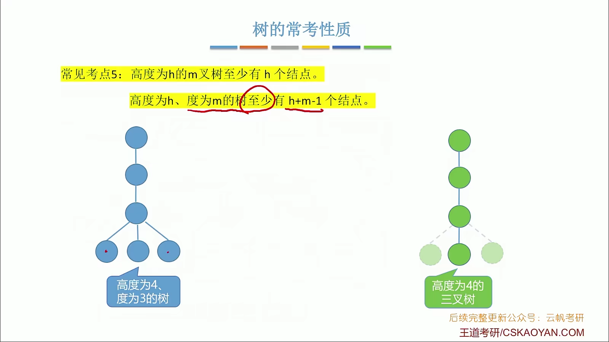
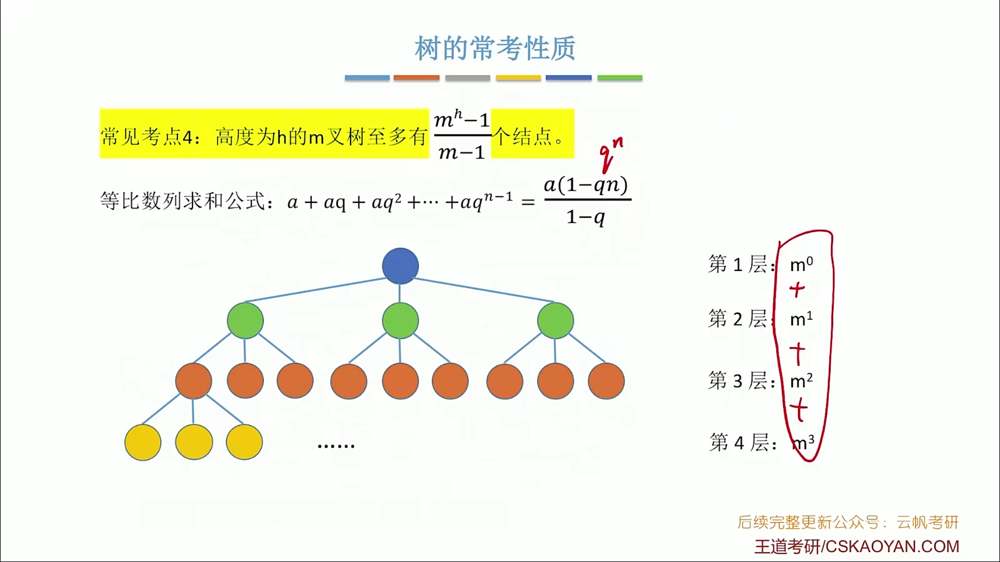
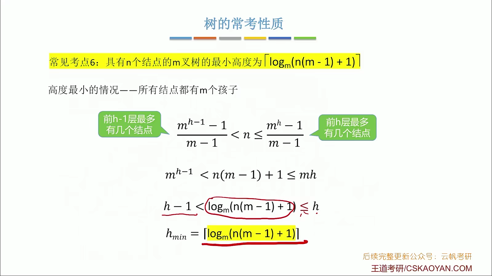
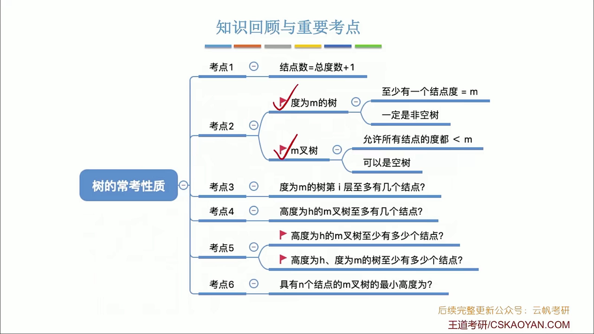

- 树的度：各结点的度的最大值
- m叉树：每个结点最多只能有m个孩子即每个结点的度都小于等于m

| 度为m的树                     | m叉树              |
| ----------------------------- | ------------------ |
| 任意节点的度 <= m             | 任意节点的度 <= m  |
| 至少有一个节点 = m            | 允许所有节点都 < m |
| 一定是非空树至少有 m+1 个节点 | 可以是空树         |

